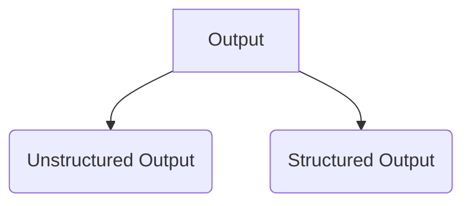
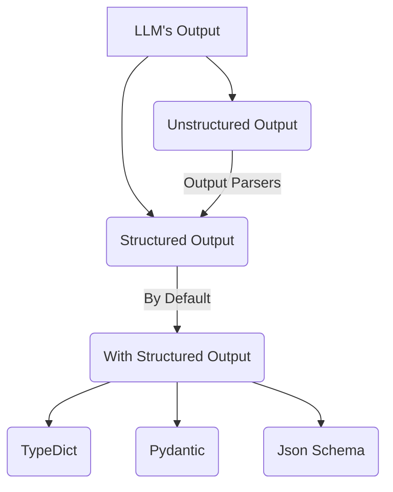
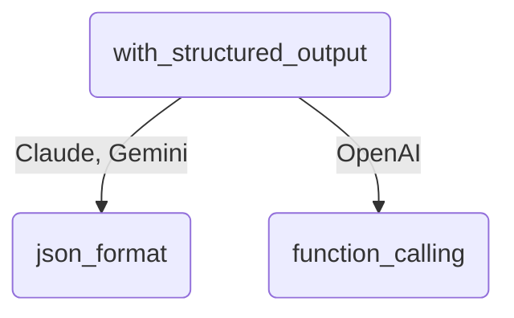

#### Notebook

---

#### Why do we need Structured Output?
- Data Extraction
- API Building
- Multi Agents

#### Few things to remember 

#### Resources
- https://github.com/campusx-official/langchain-structured-output