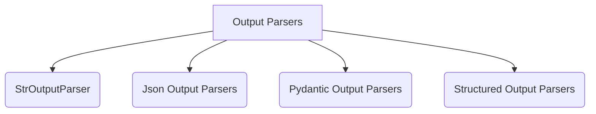

```mermaid
graph TD
    A[ Output Parsers] --> B(StrOutputParser)
    A --> C(Json Output Parsers)
    A --> D(Pydantic Output Parsers)
    A --> E(Structured Output Parsers)

```
---

Sir Code: [Repo](https://github.com/campusx-official/langchain-output-parsers)
YT: [Link](https://youtu.be/Op6PbJZ5b2Q?si=VRNwjGwcjD7jRPMQ)

---