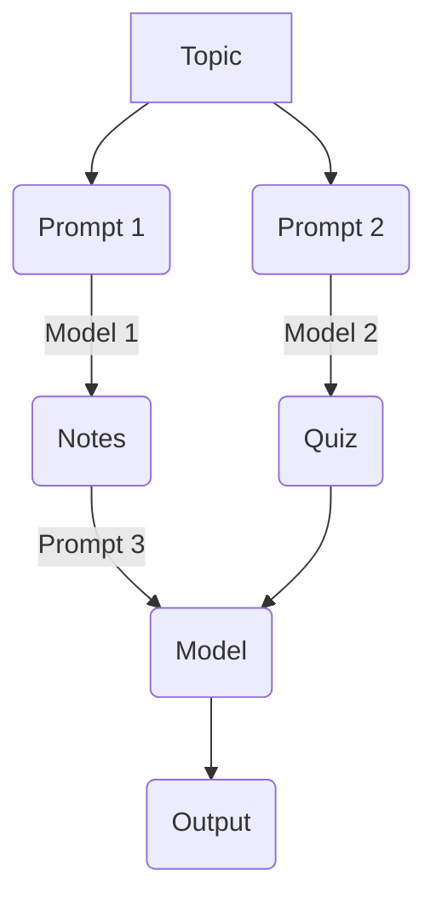
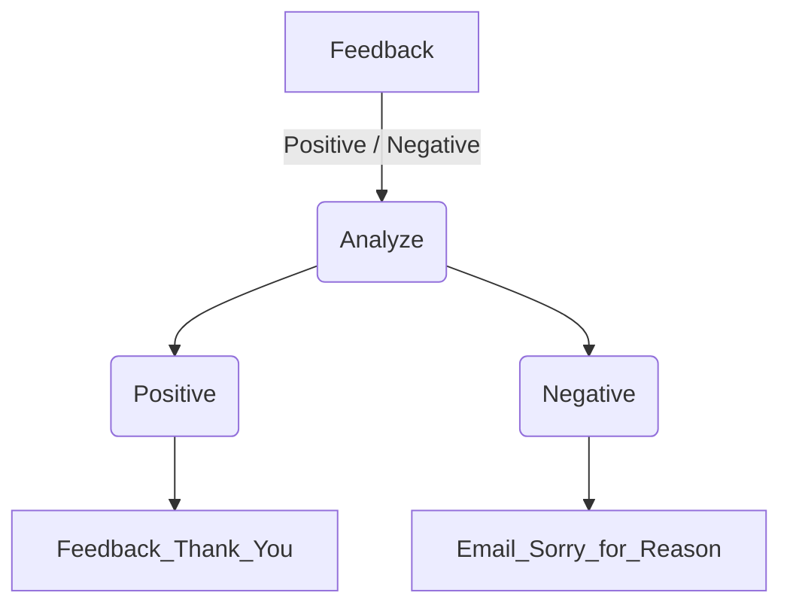

### Simple Chain

```txt
     +-------------+       
     | PromptInput |       
     +-------------+       
            *              
            *              
            *              
    +----------------+     
    | PromptTemplate |     
    +----------------+     
            *              
            *              
            *              
      +----------+         
      | ChatGroq |         
      +----------+         
            *              
            *              
            *              
   +-----------------+     
   | StrOutputParser |     
   +-----------------+     
            *              
            *              
            *              
+-----------------------+  
| StrOutputParserOutput |  
+-----------------------+
```

### Sequential Chain
```
     +-------------+       
     | PromptInput |       
     +-------------+       
            *              
            *              
            *              
    +----------------+     
    | PromptTemplate |     
    +----------------+     
            *              
            *              
            *              
      +----------+         
      | ChatGroq |         
      +----------+         
            *              
            *              
            *              
   +-----------------+     
   | StrOutputParser |     
   +-----------------+     
            *              
            *              
            *              
+-----------------------+  
| StrOutputParserOutput |  
+-----------------------+  
            *              
            *              
            *              
    +----------------+     
    | PromptTemplate |     
    +----------------+     
            *              
            *              
            *              
      +----------+         
      | ChatGroq |         
      +----------+         
            *              
            *              
            *              
   +-----------------+     
   | StrOutputParser |     
   +-----------------+     
            *              
            *              
            *              
+-----------------------+  
| StrOutputParserOutput |  
+-----------------------+  
```


### Parallel Chain



*prompt 3 we can joint any chain


```ascii
           +--------------------------+            
           | Parallel<note,quiz>Input |            
           +--------------------------+            
                ***             ***                
              **                   **              
            **                       **            
+----------------+              +----------------+ 
| PromptTemplate |              | PromptTemplate | 
+----------------+              +----------------+ 
          *                             *          
          *                             *          
          *                             *          
    +----------+                  +----------+     
    | ChatGroq |                  | ChatGroq |     
    +----------+                  +----------+     
          *                             *          
          *                             *          
          *                             *          
+-----------------+            +-----------------+ 
| StrOutputParser |            | StrOutputParser | 
+-----------------+            +-----------------+ 
                ***             ***                
                   **         **                   
                     **     **                     
          +---------------------------+            
          | Parallel<note,quiz>Output |            
          +---------------------------+            
                         *                         
                         *                         
                         *                         
                +----------------+                 
                | PromptTemplate |                 
                +----------------+                 
                         *                         
                         *                         
                         *                         
                   +----------+                    
                   | ChatGroq |                    
                   +----------+                    
                         *                         
                         *                         
                         *                         
                +-----------------+                
                | StrOutputParser |                
                +-----------------+                
                         *                         
                         *                         
                         *                         
            +-----------------------+              
            | StrOutputParserOutput |              
            +-----------------------+         
```

### Conditional Chain



```ascii
[Input Text] 
      │
      ▼
┌──────────────┐
│  Classifier  │ Parses text into a Pydantic object (Positive/Negative)
└──────┬───────┘
       │ Passes Pydantic object
       ▼
┌──────────────┐
│RunnableBranch│ Evaluates conditions sequentially
└──────┬───────┘
       ├─► If "Positive" ──► [Positive Prompt] ──► [Model] ──► [Output]
       ├─► If "Negative" ──► [Negative Prompt] ──► [Model] ──► [Output]
       └─► Otherwise     ──► [Fallback Lambda] ──► [Output]
```