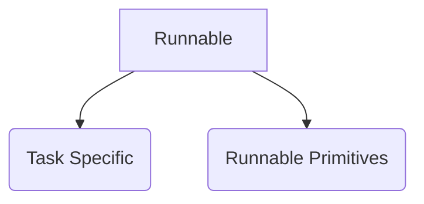

### 1. Runnable Sequence
```ascii
     +-------------+       
     | PromptInput |       
     +-------------+       
            *              
            *              
            *              
    +----------------+     
    | PromptTemplate |     
    +----------------+     
            *              
            *              
            *              
      +----------+         
      | ChatGroq |         
      +----------+         
            *              
            *              
            *              
   +-----------------+     
   | StrOutputParser |     
   +-----------------+     
            *              
            *              
            *              
+-----------------------+  
| StrOutputParserOutput |  
+-----------------------+  
            *              
            *              
            *              
    +----------------+     
    | PromptTemplate |     
    +----------------+     
            *              
            *              
            *              
      +----------+         
      | ChatGroq |         
      +----------+         
            *              
            *              
            *              
   +-----------------+     
   | StrOutputParser |     
   +-----------------+     
            *              
            *              
            *              
+-----------------------+  
| StrOutputParserOutput |  
+-----------------------+  
```

### 2. Runnable Parallel
```ascii
        +-------------------------------+          
        | Parallel<tweet,linkedin>Input |          
        +-------------------------------+          
                ***             ***                
              **                   **              
            **                       **            
+----------------+              +----------------+ 
| PromptTemplate |              | PromptTemplate | 
+----------------+              +----------------+ 
          *                             *          
          *                             *          
          *                             *          
    +----------+                  +----------+     
    | ChatGroq |                  | ChatGroq |     
    +----------+                  +----------+     
          *                             *          
          *                             *          
          *                             *          
+-----------------+            +-----------------+ 
| StrOutputParser |            | StrOutputParser | 
+-----------------+            +-----------------+ 
                ***             ***                
                   **         **                   
                     **     **                     
        +--------------------------------+         
        | Parallel<tweet,linkedin>Output |         
        +--------------------------------+     
```

### 3. Runnable Passthrough
```ascii

                 +-------------+                 
                 | PromptInput |                 
                 +-------------+                 
                        *                        
                        *                        
                        *                        
                +----------------+               
                | PromptTemplate |               
                +----------------+               
                        *                        
                        *                        
                        *                        
                  +----------+                   
                  | ChatGroq |                   
                  +----------+                   
                        *                        
                        *                        
                        *                        
               +-----------------+               
               | StrOutputParser |               
               +-----------------+               
                        *                        
                        *                        
                        *                        
       +---------------------------------+       
       | Parallel<joke,explanation>Input |       
       +---------------------------------+       
                ***            ***               
              **                  ***            
            **                       **          
+----------------+                     **        
| PromptTemplate |                      *        
+----------------+                      *        
          *                             *        
          *                             *        
          *                             *        
    +----------+                        *        
    | ChatGroq |                        *        
    +----------+                        *        
          *                             *        
          *                             *        
          *                             *        
+-----------------+             +-------------+  
| StrOutputParser |             | Passthrough |  
+-----------------+             +-------------+  
                ***            ***               
                   **        **                  
                     **    **                    
      +----------------------------------+       
      | Parallel<joke,explanation>Output |       
      +----------------------------------+     
```

### 4. Runnable Lambda
```ascii
{'joke': 'Why did the donkey get kicked out of the movie theater?\n\nBecause he was caught horsing around.', 'word_count': 17}
             +-------------+               
             | PromptInput |               
             +-------------+               
                     *                     
                     *                     
                     *                     
            +----------------+             
            | PromptTemplate |             
            +----------------+             
                     *                     
                     *                     
                     *                     
               +----------+                
               | ChatGroq |                
               +----------+                
                     *                     
                     *                     
                     *                     
           +-----------------+             
           | StrOutputParser |             
           +-----------------+             
                     *                     
                     *                     
                     *                     
    +--------------------------------+     
    | Parallel<joke,word_count>Input |     
    +--------------------------------+     
              **           **              
            **               **            
          **                   **          
+-------------+            +------------+  
| Passthrough |            | word_count |  
+-------------+            +------------+  
              **           **              
                **       **                
                  **   **                  
   +---------------------------------+     
   | Parallel<joke,word_count>Output |     
   +---------------------------------+ 
```

### 5. Runnable Branch
```ascii
  +-------------+    
  | PromptInput |    
  +-------------+    
          *          
          *          
          *          
+----------------+   
| PromptTemplate |   
+----------------+   
          *          
          *          
          *          
    +----------+     
    | ChatGroq |     
    +----------+     
          *          
          *          
          *          
+-----------------+  
| StrOutputParser |  
+-----------------+  
          *          
          *          
          *          
    +--------+       
    | Branch |       
    +--------+       
          *          
          *          
          *          
  +--------------+   
  | BranchOutput |   
  +--------------+  
```

