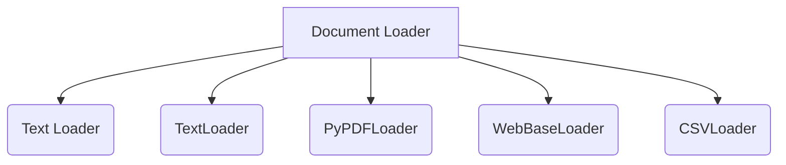

### Components of Doc Loader

---

Sir Repo: [Link](https://github.com/campusx-official/langchain-document-loaders/)
YT Video: [Link](https://www.youtube.com/watch?v=bL92ALSZ2Cg&list=PLKnIA16_RmvaTbihpo4MtzVm4XOQa0ER0&index=13)