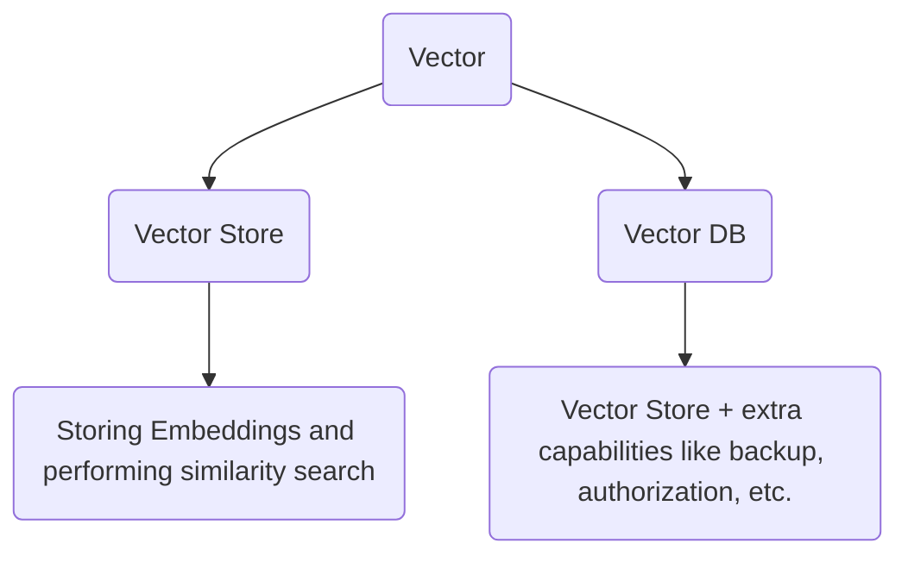

Goggle Colab: [Link](https://colab.research.google.com/drive/1VwOywJ9LPSIpKWKj9vueVoexSCzGHXNC?usp=sharing)
Sir Lecture [Link](https://www.youtube.com/watch?v=k13WK0bxQP0&list=PLKnIA16_RmvaTbihpo4MtzVm4XOQa0ER0&index=15)

---

