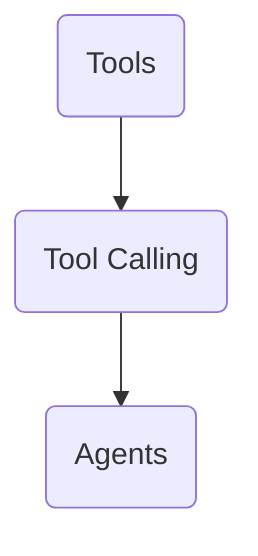
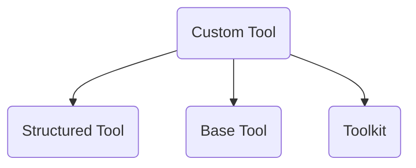

- Sir Goggle Colab: [Link](https://colab.research.google.com/drive/1GHHGsDFB5266Cc0xDsZ6OWzkB5GGSxFW?usp=sharing#scrollTo=bNuB9bmZQolv)
- YT Video: [Link](https://www.youtube.com/watch?v=etnLX7m2MiA&list=PLKnIA16_RmvaTbihpo4MtzVm4XOQa0ER0&index=18)

---

**Tool**

**Custom Tool**

